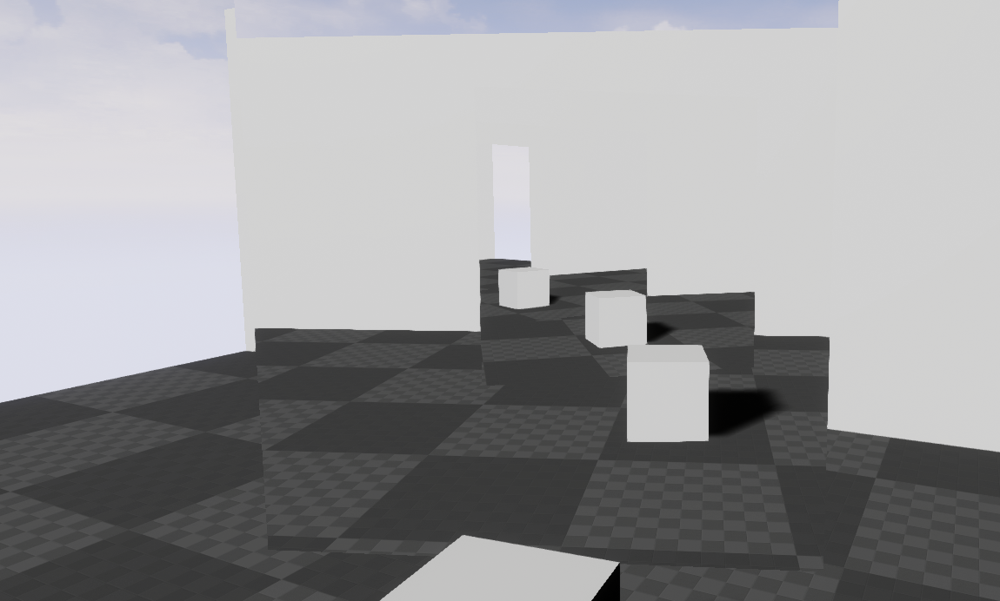

# Better Portals

Better portals for Unreal Engine 4! Took a while to figure this stuff out but I know allot of students and developers have
been asking the question of how this is done. That brings me to the purpose of this project, which is to show the use of 
portals within Unreal Engine 4 to create Non-Euclidean style game-play mechanics. There does exsist a project on the marketplace
which is similar although it is all done in blueprints.

----------------------------------------------------------------------------------

----------------------------------------------------------------------------------

Features:

- Portals
- Recursive Portal rendering.
- Portal Pawn.
- Portal function replacements.
- Portal Manager in the game mode.

The project is intended for educational purposes and free to use by anyone.